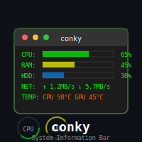

# conky information bar

This is my main info bar. I run the i3 Window Manager, but this conky bar
would be usable with any setup or WM that can host conky in a bar. I have in
the top of my screen as you can see in this screenshot:

The numbers at the top left is i3 showing the desktops, while the
top right shows in the system tray (SlimBook Battery and nm-applet for wifi
connections). The other text is all conky.

The conky bar with each element annotated:

The conky configuration (conkyrc) is the main file and includes extensive info
on all the parts at the bottom of that file. All underlying scripts are in the
scripts directory.

